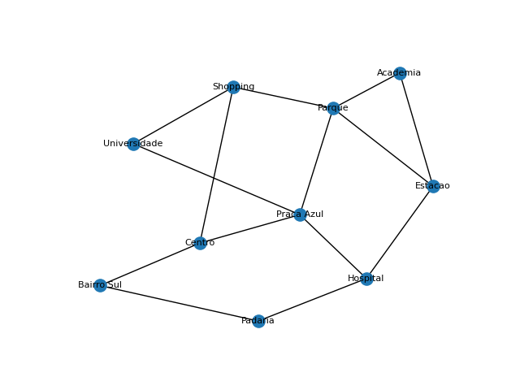
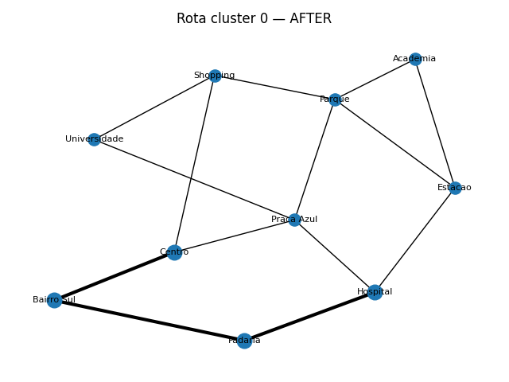
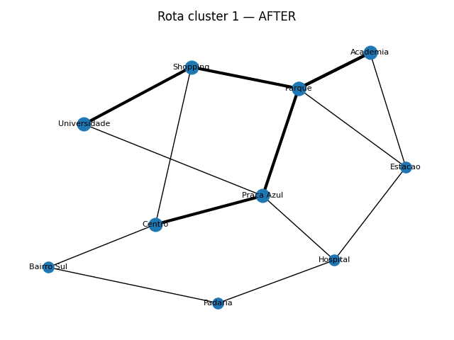

# Rota Inteligente — Otimização de Entregas com IA

Projeto de referência para a disciplina **Artificial Intelligence Fundamentals**.

## Problema
Uma empresa local de delivery (**Sabor Express**) precisa otimizar as rotas de entrega durante picos, reduzindo atrasos, custo de combustível e aumentando a satisfação dos clientes.

## Abordagem
- **Representação em grafo** (ruas como arestas, bairros/pontos como nós).
- **Busca heurística**: usamos A* (NetworkX) internamente e caminhos mínimos ponderados por distância/tempo.
- **Clustering (K-Means)** para **agrupar entregas por zonas** (1 zona por entregador).
- **Sequenciamento intra-zona**: heurística **Nearest Neighbor** para uma ordem inicial (TSP simples) + **costura** via menores caminhos no grafo.
- **Métricas**: distância total, tempo estimado, consumo e custo de combustível.
- **Visualização**: gráficos das rotas por cluster.

## Estrutura
```
rota_inteligente/
  data/         # CSVs com nós, arestas e entregas
  src/          # código-fonte (NetworkX, scikit-learn, matplotlib)
  outputs/      # imagens e relatórios gerados
  docs/         # anexos/diagramas extras
  README.md
```

## Como executar
1. Crie um ambiente virtual e instale dependências:
   ```bash
   pip install -r requirements.txt
   ```
2. Rode o pipeline com 2 entregadores:
   ```bash
   python -m src.main --drivers 2 --base .
   ```
3. Veja os resultados em `outputs/`:
   - `resumo_rotas.csv`
   - `rota_cluster_*.png`

## Dados de exemplo
- `data/nodes.csv`: id, nome e coordenadas (km)
- `data/edges.csv`: arestas com `distance_km` e `speed_kmh`
- `data/deliveries.csv`: entregas com `node_id` e janela de tempo (não usada nesta versão simples)

## Limitações & Próximos Passos
- Não consideramos **janelas de tempo** na otimização — apenas armazenadas no CSV.
- A ordem intra-cluster usa heurística simples (Nearest Neighbor). Pode ser substituída por:
  - 2‑opt/3‑opt
  - Meta‑heurísticas (Simulated Annealing, GRASP, Algoritmo Genético)
  - MILP (OR‑Tools) para VRP/TSP com restrições
- Heurística de A* pode usar **tempo** como peso, integrando trânsito histórico/tempo real.
- Suporte a **múltiplos depósitos** e **capacidade de veículo**.

## Requisitos
Crie um `requirements.txt` com:
```
networkx
matplotlib
pandas
scikit-learn
```

## Diagrama (conceitual)
Grafo da cidade (nós = locais; arestas = ruas com peso de distância/tempo). Clustering K-Means cria zonas; para cada zona, sequenciamos paradas e costuramos com caminhos mínimos.

## Licença
MIT


## 📊 Resultados

| Métrica | Média de melhoria |
|----------|------------------|
| Distância total | -4,76% |
| Tempo total | -3,56% |
| Custo de combustível | -4,76% |

**Imagens:**





Link do vídeo explicativo youtube: https://youtu.be/DqwYrRzc9sw


